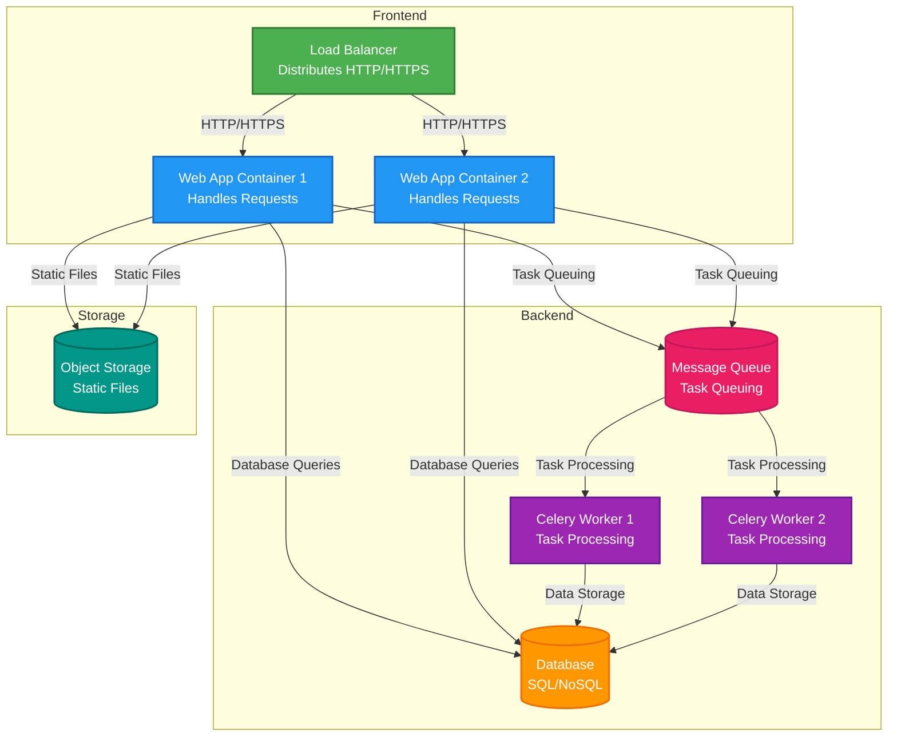

# Architecture

This document provides an overview of gestral's codebase and deployment architecture.

## Codebase

```
├── .github/                    # CI/CD workflows and configurations
├── app/                        # Main Django application
│   ├── core/                   # Core utilities - exceptions, decorators.
│   ├── common/                # Shared utilities and common components
│   ├── email/                 # Email application
│   ├── user_auth/              # User and organization management
│   └── your_app/             # Video generation functionality
├── client/                   # Frontend pages
├── db_scripts/                # Database scripts
├── infra/                     # Terraform infrastructure as code
├── Makefile                  # Build automation scripts
├── pyproject.toml            # Python project configuration
└── README.md                 # Project README
```


## Deployed Architecture

The application is deployed using a containerized architecture with the following components:

1. **Web Application Server**: A container/VM running the app Docker image generated by CI/CD pipelines
2. **Celery Workers**: One or more containers/VMs running the same Docker image but with a different entry point for background task processing
3. **Database**: A dedicated database server (managed separately)
4. **Load Balancer**: Distributes traffic between application instances (managed separately)
5. **Object Storage**: For storing static files and media (managed separately)



### Deployment Components Explained

- **Web Application Containers**: Run the main Django application, serving HTTP requests for the SPA frontend
- **Celery Worker Containers**: Process background tasks like blog checking, video generation, and email sending
- **Database**: PostgreSQL database for storing application data (not managed by this codebase)
- **Message Queue**: Redis or RabbitMQ for queuing background tasks (not detailed in this diagram)
- **Object Storage**: S3-compatible storage for static files and media (not managed by this codebase)
- **Load Balancer**: Distributes incoming traffic across multiple web application instances (not managed by this codebase)
